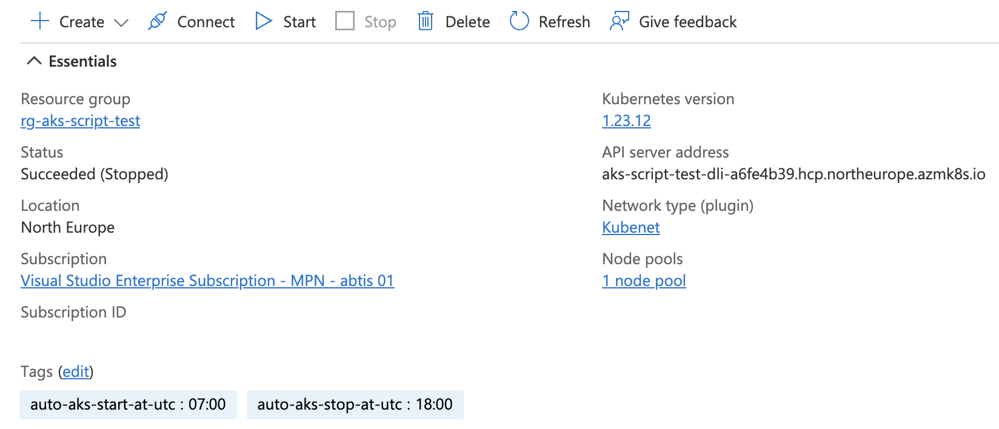

# Auto Start/Stop AKS

The AKS Start/Stop automation script helps you to automatically start and stop your Azure Kubernetes Service clusters, so they are only available within a specific time range. The automation script is build for administrators and developers who just want to run their clusters within their business hours and also safe some money.

The solution uses an Azure Automation Account for an easy integration in your system.

You can configure multiple schedules for the script to run it for different subscriptions. Ensure the managed identity has permissions to access these subscriptions.

After the deployment of the Azure resources you need to tag your AKS Cluster with `auto-aks-start-at-utc` and `auto-aks-stop-at-utc` to ensure the cluster is only available during the specified time. The tag value is a time value in *24h format*, e.g. `08:00` or `18:00`. The time needs to be set as `UTC` time.

## Prerequisites

### Ensure automation account

To use the script you need to have an Azure automation account available in your Azure environment.

You can use the *Automation Account and script deployment* to deploy an automation account along with the script.

### Set permissions for automation account's system assigned identity

The script requires an Azure Managed Identity with privileges to start and stop AKS clusters. Using the system assigned managed identity of the automation account is prefered. Giving the system assigned managed identity the role *Contributor* is a good start.

> The role *Contributor* has high permissions, but is built-in and available in every environment. It should not be used in production ready environments. A best practice is to create a custom role which only has the required permissions. A sample custom role definition in bicep format can be found here: [aks-power-manager-role.bicep](aks-power-manager-role.bicep)

#### Deploy role assignment

If you want to deploy a role assignment for an Automation accounts system assigned managed identity you can use the deployment button.

Script: [azuredeploy.roleAssignment.json](azuredeploy.roleAssignment.json)

## Deployment

### Automation Account and script deployment

Use the following deployment to provision an Azure Automation Account along with the automation script.

> Ensure to configure permissions for the Automation Account after provisioning.

You can view the script here:

- Bicep: [azuredeploy.full.bicep](azuredeploy.full.bicep)
- ARM: [azuredeploy.full.json](azuredeploy.full.json)

### Script and schedule deployment

If you already have an Azure Automation Account, you can use the following script to deploy only the *Auto Start/Stop AKS* script with a schedule.

You can view the script here:

- Bicep: [azuredeploy.runbookAndSchedule.bicep](azuredeploy.runbookAndSchedule.bicep)
- ARM: [azuredeploy.runbookAndSchedule.json](azuredeploy.runbookAndSchedule.json)

### Schedule deployment only

If you just need to deploy a new schedule to handle automatic start and stop of your AKS clusters in a new subscription, you can use this script.

You can view the script here:

- Bicep: [azuredeploy.scheduleOnly.bicep](azuredeploy.scheduleOnly.bicep)
- ARM: [azuredeploy.scheduleOnly.json](azuredeploy.scheduleOnly.json)

## Configuration

After the Azure resources are deployed, add tags to your AKS resources.

| Tag | Required | Description | Example Value |
|-----|----------|-------------|---------------|
| auto-aks-start-at-utc | Required | Time of AKS startup in 24h format as UTC time | 08:00 | 
| auto-aks-stop-at-utc | Required | Time of AKS shutdown in 24h format as UTC time | 18:00 |
| auto-aks-days | Optional | Days the AKS should start and stop (Default: Mon,Tue,Wed,Thu,Fri) | Mon,Tue,Wed,Thu,Fri,Sat |

## Customization

If the automation tags doesn't match your conventions or you just want to use other tags, you can update the script and set new values for the parameters `$TagNameBusinessHoursDays`, `$TagNameBusinessHoursStart`, `$TagNameBusinessHoursEnd`.
